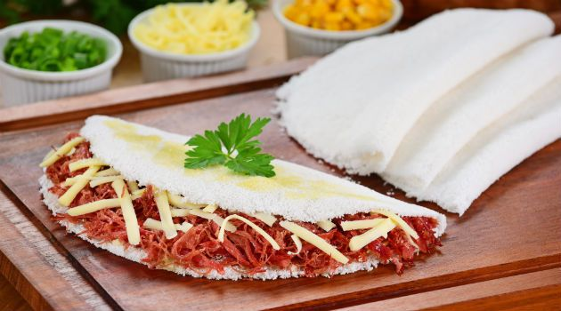

<h1 align="center"> Projeto API TAPIOCARIA ABACATE</h1>

<p align="center">

</p>

## 📝 Descrição

<p> Projeto é uma aplicação backend com NodeJS  desenvolvendo CRUD completo voltado para tapiocaria. Tem como objetivo a criação de um cadastro de usuário e tapioca, sendo possível a  autenticação do usuário, edição, adição e exclusão de cadastros.</p>

## 📚 Conteúdo

* <b>GET</b>: Busca por todos usuários ou lista todas as tapiocas.
* <b>GET/ID</b>: Busca pelo ID a tapioca.
* <b>POST</b>: É possível criar um novo usuário ou cadastra uma tapioca.
* <b>POST/AUTH</b>: Login para ter acesso a Tapiocaria.
* <b>PUT/ID</b>: Pelo ID da tapioca pode atualizar.
* <b>DELETE/ID</b>: Pelo ID pode deletar a Tapioca.

>Observação: A parte do carrinho estar em desenvolvimento.


## 🚀 Tecnologias utilizadas

* VS Code;
* NodeJS;
* JWT;
* Swagger UI;
* MongoDB.

## ⚙️ Como executar a aplicação em ambiente local

Clone o projeto:

```bash
$ git clone https://github.com/brunocarioca021/api_tapiocaria.git
```

Instale as dependencias:

```
$ npm i
```

## 🔧 Status do Projeto

<h3>
O projeto ainda está em desenvolvimento.
</h3>


